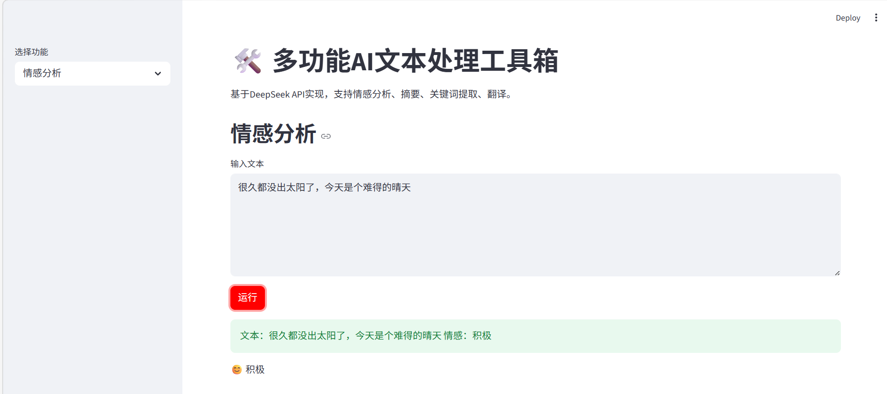
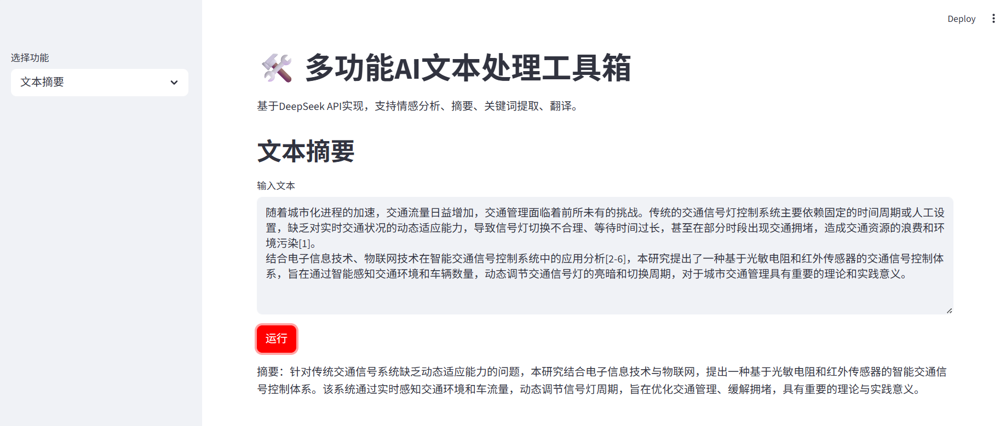
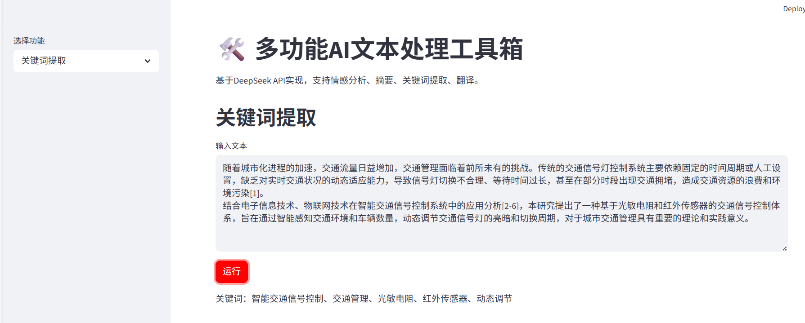
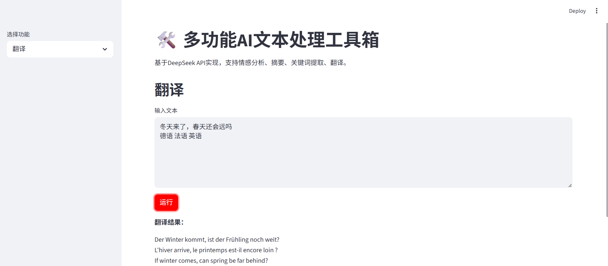

textDealBox是AI文本处理工具箱，调用deepseekAPI实现,主要功能包括：情感分析、摘要、关键词提取、翻译 
prompt.py用于设置4个功能对应的提示词&ensp;&ensp;ai_utils.py用于调用deepseekAPI&ensp;&ensp;app.py用于使用streamlit设计简单展示界面 
情感分析功能展示： 

摘要功能展示： 

关键词提取功能展示： 

翻译功能展示： 

